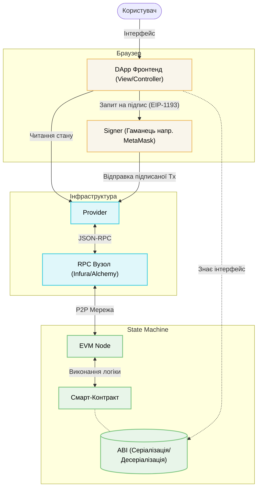
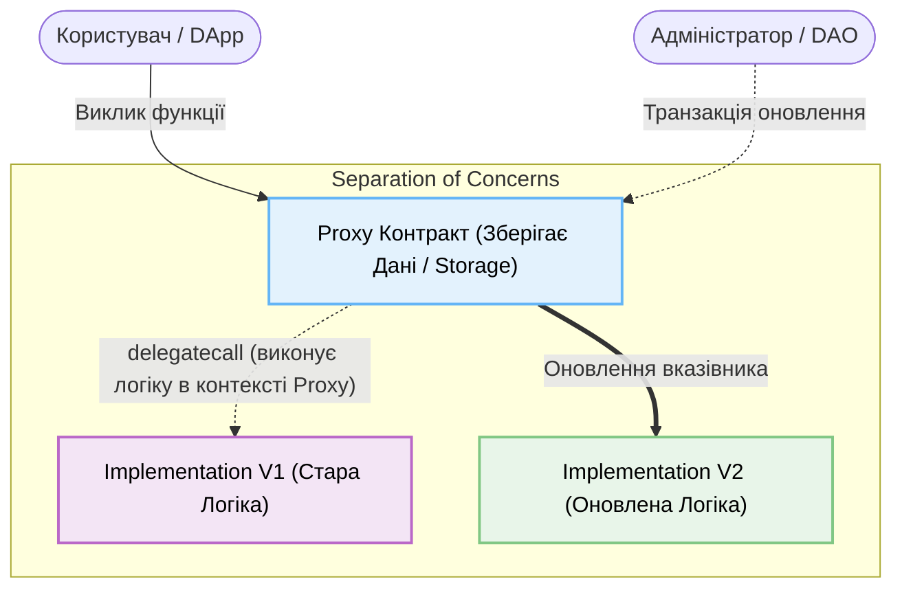

# Лекція 5.5: Сучасна екосистема (DApps)

| Знання | Ключові терміни | Навіщо це інженеру? | Пов'язані матеріали |
| :--- | :--- | :--- | :--- |
| **1. Архітектура та Інтеграція** | State Machine, ABI, RPC, Signer | Розуміння архітектурної різниці між Web2 та Web3, налаштування зв'язку клієнта з нодами. | [Розділи 1-2](#1-концепція-dapp-system-architecture) |
| **2. Еволюція екосистеми** | ERC-20, L2, Proxy-патерни, Foundry | Побудова оптимізованої, безпечної та оновлюваної логіки. | [Розділи 3-5](#3-стандартизація-бізнес-логіки-smart-contract-apis) |

Ця лекція цілком розкриває анатомію децентралізованих додатків (dApps) з точки зору класичної інженерії програмного забезпечення. 

---

## 1. Концепція dApp (System Architecture)

Щоб зрозуміти децентралізовані додатки (dApps), найпростіше провести паралель із класичною клієнт-серверною архітектурою (Web2) та архітектурними патернами (наприклад, MVC). 

З точки зору теорії систем, повноцінний dApp — це зручний клієнтський інтерфейс (View/Controller), підключений до суворо детермінованої машини станів (Model). Розглянемо архітектурну різницю порівняно з Web2:

- **База даних → State Machine (Блокчейн):** Замість SQL/NoSQL бази даних (реляційної моделі), усі дані (Model) зберігаються у глобальній системі станів. Блокчейн математично гарантує детермінованість переходів: ніхто не може приховано змінити запис, кожна зміна є криптографічно підтвердженою.
- **Бекенд (API) → Смарт-контракти (Solidity):** Бізнес-логіка виконується безпосередньо у віртуальній машині блокчейну (EVM). Смарт-контракти — це набір відкритих публічних методів, до яких може звертатися будь-який клієнт.

---

## 2. Інтеграційні примітиви (Front-end до EVM)

Смарт-контракт як бекенд та блокчейн як база даних потребують механізмів інтеграції з клієнтською частиною додатку (фронтендом). Архітектура взаємодії та місце ключових примітивів виглядають наступним чином:

Для створення цього зв'язку використовуються три ключові примітиви:

### 1. ABI (Серіалізація даних)
Щоб клієнт міг спілкуватися з відкритими методами контракту, використовується **ABI** (Application Binary Interface) — JSON-файл, який виступає аналогом Swagger. З точки зору інженерії ПЗ, ABI — це механізм серіалізації та десеріалізації даних. Це необхідно для перетворення параметрів між мовами високого рівня (наприклад, JavaScript) та бінарним середовищем EVM.

### 2. Provider (Читання стану та Мережева взаємодія)
Фронтенду потрібен канал зв'язку з блокчейном. Для цього використовується **Provider** — об'єкт, що взаємодіє з RPC (Remote Procedure Call) вузлами через протокол JSON-RPC. З точки зору еталонної моделі OSI, це зв'язок прикладного рівня. RPC-сервери тримають копію блокчейну і виконують роль "мосту" до P2P-мережі, дозволяючи додатку **читати стан** детермінованої машини.
* **Проблеми централізації:** Хоча сам блокчейн є децентралізованим, dApps часто залежать від централізованих RPC-провайдерів (Infura/Alchemy). Це створює проблему відмовостійкості (Failure-Modes). Якщо провайдер стає недоступним або скомпрометованим, додаток втрачає зв'язок з мережею, що може призвести до відмови в обслуговуванні легітимних клієнтів (Single Point of Failure).

### 3. Signer (Автентифікація та Безпека)
**Signer** (наприклад, гаманець MetaMask) виступає механізмом аутентифікації на основі криптографічних підписів замість класичних JWT/паролів.
* **EIP-1193:** Браузер ін'єктує об'єкт `window.ethereum`, який функціонує як локальний API поверх JSON-RPC для безпечного обміну командами з гаманцем.
* **Критична загроза (Blind Signing):** З точки зору аналізу архітектури безпеки блокчейну (Trust-Boundaries), використання Signer'а має небезпечний вектор атаки — **Сліпий підпис (Blind Signing)**. Якщо алгоритм кодування транзакції відображається гаманцем як набір шістнадцяткових байтів (без розшифрування на зрозумілий намір), користувач може підписати шкідливу зміну стану своєї Model, повністю втративши активи.

---

## 3. Стандартизація бізнес-логіки (Smart Contract APIs)

Оскільки сучасні dApps взаємодіють з безліччю контрактів (біржі, обмінники), розробники прийшли до необхідності створення "загальноприйнятих інтерфейсів" (стандартів). Найважливішими з них є фінансові API-стандарти токенів:

- **ERC-20 (Взаємозамінні токени):** Стандарт для криптовалют або акцій компанії. Цей інтерфейс вимагає наявності таких функцій як `balanceOf()`, `transfer()` та `approve()`.
- **ERC-721 (Невзаємозамінні токени - NFT):** Стандарт для унікальних об'єктів (нерухомість, цифрове мистецтво). Інтерфейс вимагає роботи з унікальними токен-ID через методи `ownerOf(tokenId)` та `transferFrom()`.
- **ERC-1155 (Мультитокенний стандарт):** Оптимізований стандарт (популярний в GameFi), що дозволяє керувати як взаємозамінними, так і невзаємозамінними активами в межах одного смарт-контракту, забезпечуючи пакетну передачу (batch transfers) та значну економію газу.

Підтримуючи ці стандартизовані інтерфейси в EVM, фронтенд знає наперед, як прочитати стан будь-якого фінансового активу, створеного іншими розробниками.

---

## 4. Еволюція та Масштабування (Modern Standards)

Зі швидким зростанням популярності Ethereum, розробникам довелося вирішувати обмеження системи:

### Proxy Patterns (Подолання незмінності)
За замовчуванням задеплоєний код змінити не можна. Сучасний стандарт для створення оновлюваних додатків вимагає використання **Proxy-патернів**. Це пряма реалізація класичного шаблону проєктування **Proxy (Замісник)** з ООП (тема 4.5.5 програми ЄФВВ). Шаблон розділяє систему на дві частини (Separation of Concerns):
- Контракт `Proxy` зберігає лише дані бази (Storage).
- Контракт `Implementation` зберігає саму логіку.

`Proxy` прозоро делегує виконання логіки за допомогою низькорівневої команди `delegatecall`. Для оновлення розробник просто вказує Proxy на новий контракт Implementation, вирішуючи проблему незмінності без зміни кінцевої адреси додатку.

### L2 Execution (Економіка та Алгоритмічна складність)
Шар L1 (основна мережа Ethereum) став дуже дорогим, оскільки він повинен зберігати консенсус всієї планети. Сучасна галузь перемістилась на оптимізацію: **L2 (Networks Level 2)** еволюція (Arbitrum, zkSync).
З точки зору економіки та алгоритмічної складності, обчислення виносять з L1. L2 мережі виконують тисячі "важких" операцій (Execution) у своєму суворо детермінованому середовищі, а в дорогу мережу L1 надсилають лише криптографічні докази або стиснуті агреговані дані про те, що обчислення були виконані правильно.

---

## 5. Верифікація та Інструментарій (Testing)

Для забезпечення цілісності таких складних систем виникла потреба в надійних інструментах перевірки. 

Індустрія масово перейшла від використання JavaScript/TypeScript фреймворків (Hardhat) до **Foundry** (інструментарій написаний на мові Rust). Основна інженерна мотивація цього переходу:
- **Єдине середовище:** Замість ізольованого тестування (коли контракти пишуться на Solidity, а тести на TypeScript, потребуючи постійної контекстної серіалізації/десеріалізації об'єктів), Foundry дозволяє писати тести тією ж мовою (Solidity). Це мінімізує контекстне перемикання для інженерів.
- **Швидкість:** Мова Rust та оптимізовані алгоритми дозволяють безпосередньо працювати з абстрактними синтаксичними деревами та бінарними кодами EVM, що прискорює прогін тестів у сотні разів порівняно з JS-середовищем.

---

## Definition of Done (Критерії засвоєння матеріалу)

Лекцію вважаємо успішно засвоєною, якщо студент здатен:

- [ ] **Знати анатомію Web3:** Провести аналогію та пояснити Web3-аналоги бази даних (State Machine), бекенду (Smart Contracts + ABI) та JWT/Aвтентифікації (Signer/Гаманець).
- [ ] **Розрізняти стандарти токенів:** Пояснити різницю між ERC-20 та ERC-721 і чому їх вважають "стандартизованими API".
- [ ] **Розуміти архітектуру dApps (Фронтенд):** Розрізняти ролі `Provider` (тільки читання) та `Signer` (офлайн підпис транзакцій/зміна стану).
- [ ] **Розуміти Proxy-паттерн:** Пояснити розділену архітектуру з двох контрактів (State + Logic), яка дозволяє обійти "незмінність" коду в блокчейні.
- [ ] **Аналізувати точки відмови (Failure Modes) та Загрози:** Пояснити, які ризики безпеки або відмовостійкості виникають через використання централізованих RPC-провайдерів (Infura-залежність) або механізмів сліпого підпису (Blind Signing).
