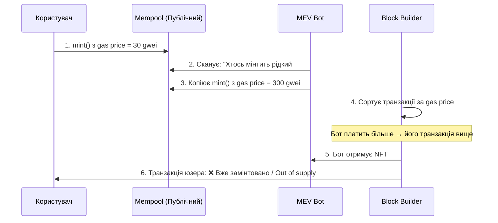

# Практикум p02: Архітектура NFT (ERC-721)

**Мета:** Навчитися проектувати архітектуру невзаємозамінних токенів (ERC-721), розуміти концепцію зберігання метаданих (IPFS), реалізовувати мінтинг колекції та критично оцінювати інженерні компроміси: газ, безпека, цілісність даних.

---

## Що таке мінтинг (Minting)?

Термін **«мінтити»** (від англ. *mint* — карбувати монети) походить із класичної фінансової сфери, де монети фізично викарбовуються на монетному дворі. У контексті блокчейну, **мінтинг — це процес створення (випуску) нового цифрового активу шляхом запису його в смарт-контракт**.

Для NFT мінтинг — це фактично момент "народження" унікального токена. Під час цього процесу смарт-контракт виконує кілька критичних дій:
1. Генерує новий унікальний ідентифікатор (`tokenId`).
2. Призначає першого власника (зазвичай того, хто ініціював транзакцію).
3. Прив'язує `tokenId` до його **метаданих** (дає посилання на те, де лежить картинка та її опис).
4. Записує цей стан у розподілений реєстр (блокчейн) назавжди.

Доки ви просто намалювали картинку і зберегли її на диску — це звичайний комп'ютерний файл. Але в той момент, коли ви її **замінтили**, у блокчейні створюється криптографічно захищений і незмінний сертифікат власності (NFT), який можна доказово продавати, передавати або використовувати в Web3-екосистемі.

---

## Питання для обговорення (Перед початком)

1. Чим фундаментально відрізняється зберігання зображення «на блокчейні» від зберігання посилання на зображення (наприклад, в IPFS)?
   <details markdown="1">
   <summary>Відповідь</summary>
   Зберігання зображення on-chain означає запис його байтів безпосередньо у storage або bytecode контракту (дуже дорого, але дані живуть вічно разом із блокчейном). Зберігання посилання — це лише запис URL/URI (декілька десятків байтів), а самі дані знаходяться на зовнішньому сервері чи в IPFS. Якщо зовнішнє сховище стане недоступним, посилання вестиме «в нікуди», тоді як on-chain дані залишаться незмінними.
   </details>

2. Якщо два NFT мають однакову картинку, але різні `tokenId` — чи є вони однаковими з точки зору блокчейну?
   <details markdown="1">
   <summary>Відповідь</summary>
   Ні. Уявіть два паспорти з різними номерами, але з однаковою фотографією всередині — це все одно два різних документи. Так само у блокчейні: кожен NFT — це унікальний запис, який ідентифікується парою `(адреса контракту, tokenId)`. Навіть якщо обидва токени посилаються на одне й те саме зображення в IPFS, блокчейн розглядає їх як два окремих активи — з різними власниками та різною історією переходу прав. Саме ця унікальність кожного запису відрізняє невзаємозамінний токен (ERC-721) від взаємозамінного (ERC-20, де кожна монета ідентична іншій).
   </details>

3. Що трапиться з вашою NFT-колекцією, якщо компанія, яка хостить метадані, збанкрутує?
   <details markdown="1">
   <summary>Відповідь</summary>
   Токени (записи у блокчейні) продовжать існувати — власники залишаться власниками `tokenId`. Але `tokenURI()` повертатиме посилання, яке більше нікуди не веде. Маркетплейси та гаманці відображатимуть порожню рамку замість зображення. Фактично NFT перетвориться на «порожній сертифікат» без візуального контенту. Саме тому критично важливо використовувати IPFS із множинним пінінгом або повне on-chain зберігання.
   </details>

---

## 1. Що таке ERC-721?

На відміну від стандарту ERC-20 (де кожна монета ідентична іншій, як долари), стандарт ERC-721 передбачає, що кожен токен є унікальним (має власний `tokenId`). 

Цей стандарт є фундаментом для цифрового мистецтва, квитків, ігрових предметів та токенізації реальних активів.

### Ключові функції стандарту ERC-721

Стандарт визначає мінімальний набір функцій, яких достатньо, щоб будь-який маркетплейс (OpenSea, Blur) або гаманець (MetaMask) міг автоматично розпізнати та відобразити ваш токен:

```solidity
// Хто є власником конкретного токена?
function ownerOf(uint256 tokenId) external view returns (address);

// Скільки токенів має конкретна адреса?
function balanceOf(address owner) external view returns (uint256);

// Передати токен від одного власника до іншого
function transferFrom(address from, address to, uint256 tokenId) external;

// Де знаходяться метадані цього токена? (Посилання на JSON)
function tokenURI(uint256 tokenId) external view returns (string memory);
```

> [!NOTE]
> **Аналогія з Реальним Світом.** ERC-721 — це як нотаріально завірений сертифікат автентичності для картини. Блокчейн — це нотаріальна книга, `tokenId` — номер запису, `ownerOf()` — хто зараз її власник, а `tokenURI()` — посилання на паспорт витвору (де знаходиться його зображення та опис).

---

## 2. Метадані та IPFS

Смарт-контракт у блокчейні не зберігає саму картинку чи великий текст (це занадто дорого). Він зберігає лише мапінг: `tokenId => TokenURI`. 

**TokenURI** — це посилання на JSON файл (зазвичай збережений в децентралізованій мережі IPFS), де знаходиться:
- Назва NFT
- Опис
- Посилання на саме зображення

### Що таке IPFS і чому саме вона?

**IPFS (InterPlanetary File System)** — це одноранговий (peer-to-peer) протокол для зберігання та передачі файлів, створений організацією Protocol Labs у 2015 році. Назва «міжпланетна файлова система» — це не маркетинг, а інженерна амбіція: протокол спроектований так, щоб працювати навіть із затримками в десятки хвилин (як між Землею та Марсом), де класична модель «клієнт → сервер» непрацездатна.

**Головна ідея: адресація за вмістом (Content-Addressing) замість адресації за розташуванням (Location-Addressing).**

```text
Location-Addressing (Класичний Web):
  https://myserver.com/images/nft42.png
  ↓
  Питання: "Де файл?" → Відповідь: "На цьому сервері"
  ⚠️ Сервер впаде → файл зникне
  ⚠️ Хтось підмінить файл → ви не дізнаєтесь

Content-Addressing (IPFS):
  ipfs://QmYwAPJzv5CZsnA625s3Xf2nemtYgPpHdWEz79ojWnPbdG
  ↓
  Питання: "Який файл?" → Відповідь: "Файл із цим хешем"
  ✅ Файл можна отримати з БУДЬ-ЯКОГО вузла, що його зберігає
  ✅ Якщо хтось змінить навіть 1 байт → CID зміниться → підміна неможлива
```

**CID (Content Identifier)** — це криптографічний хеш вмісту файлу. Якщо ви завантажите одну й ту саму картинку на 10 різних IPFS-нод у різних країнах, кожна з них видасть *однаковий* CID. Саме це забезпечує:
- **Цілісність (Integrity):** CID — це математичний доказ, що файл не підмінений.
- **Дедуплікація:** Ідентичні файли зберігаються лише один раз у мережі.
- **Децентралізація:** Файл не прив'язаний до одного сервера — будь-хто може його «закріпити» (pin) і роздавати.

> [!NOTE]
> **Чому не просто Torrent?** BitTorrent також є P2P, але він не гарантує цілісність вмісту за адресою. В IPFS сама «адреса» файлу (CID) *є* його хешем — підміна контенту алгоритмічно неможлива. Крім того, IPFS має вбудовану підтримку версіонування (через IPNS) та інтеграцію зі стандартами Web3.

### Вендори та сервіси для роботи з IPFS

IPFS — це відкритий протокол (як HTTP). Щоб працювати з ним зручно, існують комерційні сервіси — **пінінг-провайдери**. Вони гарантують, що ваші файли постійно доступні в мережі IPFS (тобто хоча б одна нода їх «закріплює»).

| Сервіс | Тип | Безкоштовний план | Особливості |
| :--- | :--- | :--- | :--- |
| **[Pinata](https://pinata.cloud/)** | IPFS Pinning | ✅ 500 файлів / 500 МБ | Найпопулярніший серед NFT-розробників. Зручний UI, API, SDK. |
| **[NFT.storage](https://nft.storage/)** | IPFS + Filecoin | ✅ Безкоштовний | Створений Protocol Labs спеціально для NFT. Дані додатково архівуються на Filecoin. |
| **[Filebase](https://filebase.com/)** | IPFS + S3-сумісний | ✅ 5 ГБ | S3-compatible API — зручний для розробників, що вже працюють з AWS. |
| **[Infura IPFS](https://infura.io/)** | IPFS Gateway + Pinning | ✅ Обмежений | Частина екосистеми Infura (ConsenSys). Інтеграція з MetaMask. |

### Альтернатива: Arweave (Перманентне зберігання)

IPFS має фундаментальну слабкість: якщо жодна нода не «закріплює» файл, він зникає. **Arweave** пропонує інший підхід — **одноразовий платіж за вічне зберігання**:

```text
IPFS:     Підписка → Платиш щомісяця → Перестав платити → Дані зникли
Arweave:  Одноразовий платіж → Дані зберігаються назавжди (endowment model)
```

Arweave використовує власний блокчейн з економічною моделлю «ендаументу»: ви платите один раз, а відсотки від цього платежу фінансують зберігання у майбутньому. Деякі NFT-проекти (наприклад, Metaplex на Solana) використовують Arweave як основне сховище метаданих.

> [!TIP]
> **Для нашого практикуму** ми використовуємо **Pinata** через простоту інтерфейсу та безкоштовний план, достатній для навчальних цілей. У продакшн-проектах рекомендується комбінувати Pinata + NFT.storage для резервування, або використовувати Arweave для критично важливих колекцій.

### Як працює зв'язка Контракт → JSON → Зображення

```text
┌──────────────────────────────────┐
│         Блокчейн (EVM)           │
│                                  │
│  tokenURI(42)                    │
│  → "ipfs://QmABC.../42.json"    │
└──────────────┬───────────────────┘
               │ (Гаманець / OpenSea читає URI)
               ▼
┌──────────────────────────────────┐
│      IPFS: 42.json               │
│  {                               │
│    "name": "Cool NFT #42",       │
│    "description": "...",         │
│    "image": "ipfs://QmXYZ..."    │
│  }                               │
└──────────────┬───────────────────┘
               │
               ▼
┌──────────────────────────────────┐
│     IPFS: Файл зображення        │
│     (PNG / SVG / MP4)            │
└──────────────────────────────────┘
```

---

## 3. Базові механіки: `_setTokenURI` vs `baseURI`

Це фундаментальне архітектурне рішення, яке визначить вартість мінтингу кожного токена і загальну газову економіку вашої колекції. Існують два підходи до побудови функції `tokenURI()`:

### Підхід A: `baseURI` + `tokenId` (Формульний)

Контракт зберігає одну єдину строку `baseURI` (наприклад, `ipfs://QmCollectionHash/`). Коли гаманець викликає `tokenURI(42)`, контракт *динамічно конкатенує* рядок: `baseURI + "42"` → `ipfs://QmCollectionHash/42`.

```solidity
contract MyNFT is ERC721 {
    string private _baseTokenURI;
    
    constructor() ERC721("MyNFT", "MNFT") {
        _baseTokenURI = "ipfs://QmCollectionHash/";
    }

    function _baseURI() internal view override returns (string memory) {
        return _baseTokenURI;
    }
    
    // tokenURI(42) автоматично поверне "ipfs://QmCollectionHash/42"
    // Жодного SSTORE під час мінтингу для URI! ✅
}
```

**Газ:** ≈ 0 додаткового газу на кожен мінт (URI обчислюється на льоту, це `view`-функція).

### Підхід B: `_setTokenURI(tokenId, uri)` (Індивідуальний)

Контракт використовує розширення `ERC721URIStorage` і зберігає окреме посилання для **кожного** токена через `mapping(uint256 => string)`.

```solidity
import "@openzeppelin/contracts/token/ERC721/extensions/ERC721URIStorage.sol";

contract MyNFT is ERC721URIStorage {
    function mintNFT(address recipient, string memory uri) public {
        uint256 newId = _nextTokenId++;
        _safeMint(recipient, newId);
        _setTokenURI(newId, uri); // ← SSTORE: запис рядка в storage
    }
}
```

**Газ:** ~20,000+ газу на кожен мінт тільки за запис URI (EVM opcode `SSTORE`). Для рядків довжиною >31 байт (а IPFS CID — це 46+ символів) вартість зростає пропорційно кількості зайнятих 32-байтних слотів.

### Порівняльна таблиця

| Критерій | `baseURI` (Формульний) | `_setTokenURI` (Індивідуальний) |
| :--- | :--- | :--- |
| **Газ на мінт (URI)** | **~0** (обчислюється динамічно) | **~20,000+** газу (SSTORE на кожен токен) |
| **Гнучкість** | Обмежена (всі URI за формулою) | Повна (кожен токен → свій URI) |
| **Мінтинг 10,000 NFT** | Економія ~200M газу | +200M газу (десятки ETH при високому gas price) |
| **Коли застосовувати** | Готова колекція з передбачуваними ID | Динамічні/унікальні метадані на токен |

> [!TIP]
> **Золоте правило:** Використовуйте `baseURI`, якщо ваші метадані мають передбачувану структуру `base + tokenId`. Це галузевий стандарт, який використовують Bored Apes, Azuki та більшість великих колекцій.

---

## Завдання: Створення NFT (Покроковий посібник)

Щоб реально "розмістити мистецтво у блокчейні", нам потрібно побудувати чіткий конвеєр (Pipeline) від картинки на вашому жорсткому диску до токена в мережі.

### КРОК 1: Підготовка візуалу та завантаження в IPFS

Децентралізований додаток вимагає децентралізованого зберігання файлів.
1. Зареєструйтесь у сервісі **Pinata** (або NFT.storage). Це зручний міст між звичайним інтернетом та файловою системою IPFS.
2. Завантажте ваше обране зображення (мистецтво) через інтерфейс сервісу.
3. Отримайте унікальний **CID (Content Identifier)** для цього файлу. 
4. Ваш базовий лінк на зображення матиме такий вигляд: `ipfs://<CID_вашої_картинки>`.

> [!IMPORTANT]
> **Що таке CID?** Content Identifier — це криптографічний хеш вмісту файлу. Якщо хтось змінить навіть один піксель у зображенні, CID повністю зміниться. Це фундаментальна гарантія цілісності: маючи CID, ви завжди можете перевірити, чи отримали оригінальний файл.

### КРОК 2: Створення JSON-метаданих

Смарт-контракти стандарту ERC-721 очікують, що TokenURI міститиме не просто картинку, а стандартизований "паспорт" токена у форматі JSON.
1. Створіть локальний файл під назвою `metadata.json` і вставте туди цей шаблон:

```json
{
  "name": "Моє перше крипто-мистецтво",
  "description": "Опис твору для курсу",
  "image": "ipfs://<CID_отриманий_на_Кроці_1>",
  "attributes": [
    { "trait_type": "Рідкість", "value": "Legendary" },
    { "trait_type": "Фон", "value": "Космос" }
  ]
}
```
2. Збережіть цей JSON і також завантажте його в IPFS (через ту ж саму Pinata).
3. Отримайте **другий CID** (CID вашого JSON-файлу). Це і є ваш фінальний **TokenURI**.

> [!NOTE]
> **Поле `attributes`** — це масив властивостей, який використовують маркетплейси (OpenSea, Blur) для фільтрації та відображення рідкості (rarity). Кожна пара `trait_type` / `value` стає фільтром у бічній панелі маркетплейсу. Це не обов'язкове поле, але без нього ваш NFT виглядатиме "порожнім" на платформах.

### КРОК 3: Написання смарт-контракту

Замість копіювання штучного коду від ШІ, ми напишемо контракт самостійно, розуміючи кожну деталь. Відкрийте [Remix IDE](https://remix.ethereum.org/) і створіть файл `MyNFT.sol`:

```solidity
// SPDX-License-Identifier: MIT
pragma solidity ^0.8.20;

// Імпортуємо перевірений код від OpenZeppelin (галузевий стандарт безпеки)
import "@openzeppelin/contracts/token/ERC721/extensions/ERC721URIStorage.sol";
import "@openzeppelin/contracts/access/Ownable.sol";

contract MyNFT is ERC721URIStorage, Ownable {
    uint256 private _nextTokenId;

    // Конструктор: задаємо ім'я колекції та символ (тікер)
    constructor() ERC721("ONU Art Collection", "ONU") Ownable(msg.sender) {}

    /// @notice Карбує новий NFT та призначає йому індивідуальний URI
    /// @param recipient Адреса, яка отримає NFT
    /// @param tokenURI_ Посилання на JSON-метадані в IPFS
    /// @dev Тільки власник контракту може викликати цю функцію (onlyOwner)
    function mintNFT(address recipient, string memory tokenURI_)
        public
        onlyOwner
        returns (uint256)
    {
        uint256 tokenId = _nextTokenId++;
        _safeMint(recipient, tokenId);   // Створюємо токен
        _setTokenURI(tokenId, tokenURI_); // Прив'язуємо метадані
        return tokenId;
    }
}
```

**Розбір кожного рядка:**

| Рядок | Що робить | Навіщо |
| :--- | :--- | :--- |
| `ERC721URIStorage` | Базовий клас від OpenZeppelin | Реалізує весь стандарт ERC-721 + зберігання URI |
| `Ownable` | Модифікатор доступу | Тільки deployer (власник) може мінтити |
| `_nextTokenId` | Лічильник | Автоматично генерує унікальні ID (0, 1, 2...) |
| `_safeMint` | Створення токена | Перевіряє, чи отримувач може прийняти NFT |
| `_setTokenURI` | Запис метаданих | Прив'язує IPFS URI до конкретного tokenId |

### КРОК 4: Деплой та Карбування (Minting) у Remix

1. Скопіюйте смарт-контракт у [Remix IDE](https://remix.ethereum.org/).
2. Скомпілюйте його (Compiler version: 0.8.20+).
3. Перейдіть до вкладки Deploy. Змініть Environment на **Injected Provider - MetaMask** і задеплойте контракт у тестову мережу **Sepolia** (потрібен тестовий ETH).
4. Розгорніть панель вашого контракту. Викличте функцію `mintNFT`:
   - У поле `recipient` вставте свою адресу гаманця.
   - У поле `tokenURI_` вставте посилання з Кроку 2: `ipfs://<CID_вашого_JSON>`.
5. Підтвердіть транзакцію в MetaMask.

### КРОК 5: Перевірка результату

Студент має відчути результат своєї роботи візуально.
1. Перейдіть на маркетплейс [OpenSea Testnet](https://testnets.opensea.io/).
2. Підключіть свій гаманець MetaMask.
3. Перейдіть у свій профіль. OpenSea (користуючись своїми агрегаторами) автоматично прочитає стандарт ERC-721 на блокчейні, розпакує посилання до IPFS, прочитає `metadata.json` і чудово відобразить ваше мистецтво!

---

## 4. Просунута оптимізація газу

Уявіть: команда готує дроп на **10 000** аватарів. Перший тестовий мінт у Remix проходить чудово — один токен, одна транзакція, газ «терпимо». Потім продакт каже: *«зробімо whitelist: кожен мінтить по п’ять штук за раз»*. Ви додаєте цикл у контракті стандартного **ERC-721** і раптом бачите рахунок у гаманці: **п’ять окремих записів у сховище — п’ять разів плата за `SSTORE`**. Множите на тисячі користувачів і тисячі токенів — і дроп перетворюється на **нездійсненну** ідею: користувачі просто не натиснуть «Confirm», а проєкт не збере бюджет на газ.

Ось тут і з’являється інженерна задача, яку ми зараз розв’язуємо: **як зберегти стандарт NFT і маркетплейси, але змінити внутрішню бухгалтерію контракту**, щоб масовий випуск колекції не вимагав платити «повну ціну» за кожен окремий токен ні на мінті, ні (за можливості) в експлуатації.

### 4.1. ERC-721 vs ERC-721A: Батч-мінтинг

Стандартний **ERC-721** (OpenZeppelin) зберігає власника кожного токена окремо. Мінтиш 5 NFT — платиш за 5 записів (`SSTORE`). 

**ERC-721A** (від команди Azuki) робить інакше: мінтинг $N$ токенів коштує майже як один. 

**Секрет економії:**
Контракт записує власника лише для *першого* токена в батчі. Якщо `owner[2]` порожній, контракт розуміє, що власник — той самий, що й у `owner[1]`.

```text
ERC-721:  3 мінти = 6 записів у storage (дорого)
ERC-721A: 3 мінти = 2 записи у storage (дешево)
```

**Економіка газу:**
- **1 NFT:** ERC-721 (~51k) ≈ ERC-721A (~52k)
- **5 NFT:** ERC-721 (~255k) vs ERC-721A (~55k) 🚀
- **100 NFT:** ERC-721 (~5.1M) vs ERC-721A (~60k) 🔥

> [!WARNING]
> **Компроміс (Lazy Init):** Економія газу досягається через відкладену ініціалізацію. **Перший переказ** токена буде дорожчим, бо контракту доведеться записати реального власника в storage. Це ідеальний компроміс для масових drop-колекцій, де важлива ціна первинного мінту.

### 4.2. Другий фронт економії: дрібниці в коді та вибір мережі

Уявіть інший поворот сюжету. Ви вже зрозуміли **721A** — або у вас невелика колекція, і батч-оптимізація не головний важіль. Ви відкриваєте **gas estimator** у Remix або в гаманці — і цифра все одно «кусається». Ніби великий ворог переможений, а транзакція залишається дорогою.

Тут важливо розрізняти два рівні: **архітектуру стандарту** (схема власників, батч-мінт) і **повсякденні рішення в Solidity** — лічильник токенів, виклик `_safeMint` замість `_mint`, окремий `tokenURI` для кожного ID замість одного `baseURI`, нарешті **шар мережі** (Ethereum L1 проти L2). Усе це не «магія оптимізації», а відповідь на просте питання: *де саме контракт зайвий раз читає/пише storage і викликає дорогі перевірки?*

Нижче — типові місця, де студентський контракт «під’їдає» газ без потреби, і як їх виправити.

| Проблема | Виправлення | Коментар |
|----------|-------------|----------|
| **`Counters.sol`** у OpenZeppelin 5.x застарів; зайва обгортка навколо лічильника | Оголосити `uint256 private _nextTokenId` і збільшувати `++_nextTokenId` (або постфікс за стилем коду) | Менше операцій і залежностей; відповідає рекомендаціям OZ для нових проєктів |
| **`_safeMint` скрізь**, навіть коли отримувач — звичайний гаманець (EOA) | Для EOA використовувати **`_mint(to, tokenId)`**; **`_safeMint`** лишати, коли отримувач може бути **контрактом** і має прийняти NFT через `onERC721Received` | `_safeMint` додає зовнішній виклик і перевірку `IERC721Receiver` — зайвий газ, якщо адреса не контракт |
| Окремий **`_setTokenURI`** на кожен `tokenId` | Якщо URI передбачувані (`…/1.json`, `…/2.json`), задати **`baseURI`** і при потребі **`_baseURI()`** / суфікс | Менше записів у **storage** на кожен токен; дешевший мінт великої серії |
| Масовий мінт кількох NFT **одному власнику** «в лоб» на класичному **ERC-721** | Для такого сценарію дропу розглянути **ERC-721A** (батч-мінт) | Деталі та компроміси — у **п. 4.1** вище в цьому документі |
| Високий газ на **Ethereum L1** незалежно від дрібних правок у контракті | Деплой і мінт на **L2** (наприклад Base, Arbitrum), якщо підходить продукт і ліквідність | Змінюється **мережа виконання**, не лише Solidity; ціна інструкцій і storage часто на порядки нижча |

---

## 5. Аудит цілісності метаданих

Мінтинг — це лише половина архітектури NFT. Друга половина — це **цілісність метаданих**: чи точно ваша NFT буде «жити» через 10 років?

### 5.1. Ризики централізації IPFS Gateways

IPFS за своєю природою є децентралізованою мережею. Проте у реальності більшість користувачів взаємодіють з IPFS через **централізовані шлюзи (gateways)** — HTTP-сервіси, що перетворюють `ipfs://QmXYZ...` на звичайне посилання `https://gateway.pinata.cloud/ipfs/QmXYZ...`.

**Проблема Pinning (Закріплення):**

```text
Сценарій загибелі NFT:

1. Розробник завантажує зображення в Pinata → отримує CID
2. Контракт зберігає tokenURI = "ipfs://CID_зображення"
3. Розробник перестає платити Pinata (або Pinata закривається)
4. Жоден вузол IPFS більше не "закріплює" (pins) цей CID
5. Дані видаляються зборщиком сміття IPFS
6. Маркетплейс запитує tokenURI → отримує... нічого
7. NFT відображається як порожня рамка 🖼️❌
```

> [!CAUTION]
> **Парадокс децентралізації:** Ваш токен у блокчейні — вічний. Але зображення, яке він представляє, живе рівно стільки, скільки хтось платить за його зберігання. Якщо ваш TokenURI починається з `https://` — це класичний Web2-хостинг, і при його відключенні NFT стає «порожнім сертифікатом».

**Стратегії захисту від втрати метаданих:**

| Рівень захисту | Стратегія | Надійність |
| :--- | :--- | :--- |
| ❌ Низький | `https://myserver.com/nft/42.json` | Сервер впаде — NFT мертвий |
| ⚠️ Середній | `ipfs://CID` через один пінінг-сервіс | Якщо сервіс закриється — дані зникнуть |
| ✅ Високий | `ipfs://CID` + пінінг через 2+ незалежних провайдерів | Резервування через Pinata + NFT.storage + власна нода |
| 🏆 Максимальний | Повне зберігання on-chain (SSTORE2 / SVG) | Живе стільки, скільки живе блокчейн |

### 5.2. Конкуренція при мінтингу (MEV та Front-Running)

Коли ви натискаєте «Mint» у dApp, ваша транзакція не потрапляє одразу у блок. Вона спочатку «зависає» у публічному пулі очікування — **Mempool** — де її може побачити будь-хто, включаючи автоматизованих ботів.

**Як працює Front-Running при мінтингу:**



**Стратегії захисту від MEV-ботів (Maximal Extractable Value):**

> [!NOTE]
> **Що таке MEV?** MEV (Maximal Extractable Value, раніше Miner Extractable Value) — це максимальна видобувна цінність. Це прибуток, який може отримати валідатор або бот за рахунок маніпуляції порядком транзакцій (включення, виключення або перестановка) всередині блоку. У нашому випадку бот використовує MEV, щоб перехопити вашу транзакцію мінтингу.

1. **Commit-Reveal Scheme (Двофазний мінтинг):**
   ```solidity
   // Фаза 1: Commit — користувач відправляє хеш свого наміру
   function commitMint(bytes32 hash) external { commits[msg.sender] = hash; }
   
   // Фаза 2: Reveal — відкриває поверх хешу (бот не знав, що мінтити)
   function revealMint(uint256 tokenId, bytes32 salt) external {
       require(commits[msg.sender] == keccak256(abi.encodePacked(tokenId, salt)));
       _mint(msg.sender, tokenId);
   }
   ```
2. **Приватні транзакції (Flashbots Protect):** Транзакція надсилається напряму блок-білдеру, минаючи публічний Mempool. Бот просто не бачить вашої транзакції.
3. **Обмеження на рівні контракту:**
   ```solidity
   // Обмеження: 1 мінт на адресу + максимум 2 мінти за блок
   mapping(address => bool) public hasMinted;
   uint256 public mintsThisBlock;
   uint256 public lastMintBlock;
   
   modifier antiBot() {
       require(!hasMinted[msg.sender], "Already minted");
       if (block.number != lastMintBlock) {
           lastMintBlock = block.number;
           mintsThisBlock = 0;
       }
       require(mintsThisBlock < 2, "Block mint limit");
       mintsThisBlock++;
       hasMinted[msg.sender] = true;
       _;
   }
   ```

---

## 6. Поза екосистемою: NFT у не-EVM мережах

Ethereum — не єдиний спосіб реалізувати NFT. Інші блокчейни пропонують фундаментально інші архітектурні підходи.

### 6.1. Solana: Compressed NFTs (cNFTs)

Solana вирішила проблему вартості мінтингу мільйонів NFT через **State Compression** — техніку, де кожен NFT не зберігається як окремий акаунт, а лише входить у **Concurrent Merkle Tree**.

```text
Класичний NFT на Solana:
  1 NFT = 1 Account = оплата "ренти" за зберігання
  1,000,000 NFT ≈ $240,000 (rent-exempt)

Compressed NFT (cNFT):
  1,000,000 NFT = 1 Merkle Tree акаунт
  On-chain зберігається лише Merkle Root (32 байти)
  Метадані — off-chain (але криптографічно верифіковані!)
  Вартість: ≈ $100–200 за 1 мільйон NFT
```

**Що можна запозичити для EVM:** Концепцію Merkle-based ownership proof для масштабних airdrop'ів та ігрових активів. У Ethereum це частково реалізовано через **ERC-6551** (Token Bound Accounts) та паттерни Merkle-proof whitelisting.

### 6.2. Sui: Об'єктна модель

Sui відмовився від глобального стану (як mapping у Solidity). Натомість **кожен NFT — це окремий об'єкт** з власним ID, власником та версією.

```text
EVM (Ethereum):
  Контракт→mapping(tokenId => owner) = Глобальний реєстр
  Переказ = Зміна запису у глобальному mapping

Sui (Object-Centric):
  NFT = Об'єкт {UID, owner, version, data}
  Переказ = Зміна поля owner в об'єкті
  Паралельна обробка! (Об'єкти не конфліктують)
```

**Ключова перевага:** Оскільки кожен NFT — це незалежний об'єкт, Sui може обробляти транзакції з *різними* NFT **паралельно**, тоді як EVM виконує всі транзакції послідовно. Це знімає проблему «газових воєн» при гарячих мінтах.

### 6.3. Порівняльна таблиця архітектур NFT

| Критерій | Ethereum (ERC-721) | Solana (cNFT) | Sui (Objects) |
| :--- | :--- | :--- | :--- |
| **Модель** | Mapping у контракті | Merkle Tree | Незалежні об'єкти |
| **Мінтинг 1M NFT** | $50,000+ (L1) | ~$100–200 | ~$300–500 |
| **Паралелізм** | Послідовний | Частковий | Повний |
| **Динамічні NFT** | Складно (SSTORE) | Off-chain | Нативно (mut об'єкт) |
| **Екосистема/ліквідність** | 🏆 Найбільша | Велика | Зростає |
| **Безпека/аудити** | 🏆 Найзріліша | Молода | Дуже молода |

---

## 7. Сильна аргументація (Steelmanning): Чому On-Chain метадані можуть бути кращими

Навіть маючи найнадійнішу IPFS-конфігурацію, залишається архітектурний ризик: метадані *відокремлені* від токена. Чи можна зберігати все on-chain?

### 7.1. SSTORE2: Код як сховище

Стандартний `SSTORE` (запис у storage) коштує ~20,000 gas на 32 байти. Але існує елегантний хак: **зберігати дані в байткоді контракту**, а не в його storage.

```text
Стандартний SSTORE:
  Запис 1 КБ ≈ 640,000 gas (20,000 × 32 слоти)
  Читання: SLOAD (2,100 gas × 32)

SSTORE2 (Code-as-Storage):
  Запис 1 КБ: CREATE новий контракт з даними як байткод
  ≈ 200,000 gas + 200 gas/байт = ~400,000 gas (дешевше!)
  Читання: EXTCODECOPY ≈ 2,600 gas (значно дешевше!)
```

### 7.2. On-Chain SVG Art

SVG (Scalable Vector Graphics) — це текстовий формат зображень на основі XML. Оскільки SVG — це текст, його можна генерувати прямо в Solidity:

```solidity
function tokenURI(uint256 tokenId) public view override returns (string memory) {
    // Генеруємо SVG прямо у контракті
    string memory svg = string(abi.encodePacked(
        '<svg xmlns="http://www.w3.org/2000/svg" width="350" height="350">',
        '<rect width="100%" height="100%" fill="#', getColor(tokenId), '"/>',
        '<text x="50%" y="50%" text-anchor="middle" fill="white" font-size="24">',
        'Token #', Strings.toString(tokenId),
        '</text></svg>'
    ));
    
    // Повертаємо data URI (ніякого IPFS!)
    string memory json = string(abi.encodePacked(
        '{"name":"On-Chain NFT #', Strings.toString(tokenId),
        '","image":"data:image/svg+xml;base64,', Base64.encode(bytes(svg)), '"}'
    ));
    
    return string(abi.encodePacked("data:application/json;base64,", Base64.encode(bytes(json))));
}
```

### 7.3. Аргументи ЗА on-chain метадані (Steelman)

| Аргумент | Обґрунтування |
| :--- | :--- |
| **1. Абсолютна незнищенність** | Метадані живуть стільки, скільки живе блокчейн. Жодний сервіс не може «забути» їх. |
| **2. Композабельність** | Інші контракти можуть читати та використовувати атрибути NFT on-chain (для ігор, DeFi, голосувань). З IPFS це неможливо без оракулів. |
| **3. Динамічність** | On-chain NFT може змінюватися на основі on-chain подій (час, ціна ETH, дії власника). Nouns DAO генерує нове зображення кожен день! |
| **4. Провенанс** | Весь історичний стан метаданих зберігається у блокчейні. Неможливо підмінити зображення після продажу. |
| **5. Прецедент вартості** | Найдорожчі колекції (Autoglyphs, Art Blocks) доводять, що ринок оцінює on-chain art дорожче, ніж IPFS-linked. |

> [!NOTE]
> **Реальні приклади On-Chain NFT:**
> - **Autoglyphs** (Larva Labs, 2019) — перше повністю on-chain генеративне мистецтво. Алгоритм вбудований у контракт.
> - **Nouns** — кожен день автоматично генерується новий NFT. Зображення складається з RLE-стиснених частин (голова, окуляри, тіло), що зберігаються on-chain та асемблюються у SVG при виклику `tokenURI()`.
> - **Loot (for Adventurers)** — лише текстові атрибути («Holy Greaves of Giants»), повністю on-chain. Спільнота побудувала ціле всесвіт навколо цих текстових рядків.

---

## 8. Огляд найдорожчих NFT та технічний аналіз їхньої цінності

Щоб зрозуміти, що саме створює цінність NFT, розглянемо топ-5 найдорожчих продажів і проаналізуємо їх з інженерної точки зору.

| # | NFT | Ціна (USD) | Дата | Блокчейн |
| :---: | :--- | ---: | :--- | :--- |
| 1 | **The Merge** (Pak) | $91,800,000 | Грудень 2021 | Ethereum |
| 2 | **Everydays: The First 5000 Days** (Beeple) | $69,300,000 | Березень 2021 | Ethereum |
| 3 | **Clock** (Pak & Julian Assange) | $52,700,000 | Лютий 2022 | Ethereum |
| 4 | **HUMAN ONE** (Beeple) | $28,900,000 | Листопад 2021 | Ethereum |
| 5 | **CryptoPunk #5822** (Larva Labs) | $23,700,000 | Лютий 2022 | Ethereum |

### Технічний розбір цінності

**The Merge ($91.8M)** — художник Pak не продавав одну картинку за $91.8M. Натомість він створив смарт-контракт із унікальною механікою:
- Контракт продавав **«маси» (mass)** — це звичайні взаємозамінні токени (схожі на ERC-20), які будь-хто міг купити протягом 48 годин. 28,983 колектори купили маси на загальну суму $91.8M.
- Кожен покупець отримав **NFT-об'єкт** (ERC-721), візуальний розмір якого *визначався кількістю придбаних мас*. Більше мас = більша яскрава куля на чорному фоні.
- **Ключова механіка «злиття» (merge):** якщо один гаманець передає свій NFT іншому гаманцю, який вже має NFT цієї колекції — два об'єкти **зливаються в один**. Маси додаються, куля збільшується, а другий токен спалюється (burn). Тобто загальна кількість NFT у колекції **постійно зменшується** з часом.
- Це приклад, де не зображення визначає цінність, а **логіка смарт-контракту**: мистецтво — це сам алгоритм злиття, що робить колекцію дефляційною (кожен трансфер зменшує загальну пропозицію токенів).

**CryptoPunks ($23.7M за #5822)** — Punks не використовують стандарт ERC-721! Вони створені у 2017 році, *до* появи стандарту. Larva Labs написали власний кастомний контракт, що ускладнює інтеграцію з сучасними маркетплейсами. Зображення 24×24 пікселів зберігаються *off-chain*, але їхній **composited hash** записаний у контракті як `imageHash`, що гарантує автентичність. #5822 — один із 9 «Alien» панків, рідкість яких визначається початковим алгоритмом генерації (trait probability distribution).

**Loot & Autoglyphs (культурна цінність)** — хоча їхні продажі не потрапили у топ-5, вони є архітектурно найважливішими: 100% on-chain з нульовою залежністю від зовнішніх сервісів. Autoglyphs доводять, що *код — це мистецтво*, а Loot демонструє, що метадані можуть бути *будівельними блоками* для цілого екосистемного всесвіту. Щодо **геогліфів Наски**: у відкритих описах Autoglyphs **немає** твердження, що це було прямим джерелом ідеї (зазвичай наголошують на ранній **комп’ютерній** генеративній графіці та на обмеженнях **on-chain** зберігання). Натомість **інженерно-культурна аналогія** справедлива: як нагірні лінії в пустелі «тримаються» в матеріалі землі й читаються з дистанції, так повністю ланцюговий артефакт тримається в **матеріалі мережі** — його можна знову згенерувати й верифікувати з коду, а не підтягувати з URL на чужому сервері.

> [!IMPORTANT]
> **Формула цінності NFT (спрощена):**
> ```
> Цінність = f(Rarity Algorithm) × f(On-Chain Logic) × f(Cultural Signal) × f(Metadata Integrity)
> ```
> - **Rarity Algorithm:** Як детермінований алгоритм розподіляв характеристики (traits)? (Наприклад, лише 9 Alien punks із 10,000).
> - **On-Chain Logic:** Чи має контракт унікальну механіку? (The Merge: маси; Nouns: щоденна генерація).
> - **Cultural Signal:** Історичний прецедент, спільнота, колекційний статус.
> - **Metadata Integrity:** Де живуть дані? On-chain > IPFS > HTTP server.

---

## 🎓 Інженерний міні-кейс (на 1 бал)

Ви успішно задеплоїли колекцію NFT і розпродали її за 10 хвилин. Фотографії ваших NFT зберігалися на вашому власному сервері (AWS) з прив'язкою через класичний `https://` TokenURI. Через рік ви забули оплатити хостинг AWS, і сервер вимкнувся.
**Питання:** Що побачать власники NFT у своїх крипто-гаманцях? Чи зберегли вони своє цифрове мистецтво? Обґрунтуйте відповідь в контексті IPFS.

<details markdown="1">
<summary>👉 <b>Розкрити відповідь для самоперевірки</b></summary>

**Відповідь:** Власники побачать порожню рамку (broken image). Їхній *токен* (запис у блокчейні) все ще існує — вони лишаються власниками `tokenId`. Але `tokenURI()` повертає `https://` посилання, яке більше нікуди не веде. Зображення та метадані **втрачені назавжди**.

Якби розробник використав IPFS (`ipfs://CID`), ситуація могла б бути іншою: CID — це хеш вмісту, тому якщо хоча б *одна нода* у мережі IPFS ще зберігає цей файл, його можна отримати. Проте якщо ніхто не «закріплює» (pins) файл — він також зникне. Найнадійніше рішення — зберегти все on-chain.

</details>

## 🎓 Додатковий міні-кейс (бонус, поза 10 балами поточного контролю)

Ви розробляєте NFT-колекцію з 10,000 унікальних предметів. Ваш інвестор вимагає мінімізувати газ при масовому мінтингу, але ваш дизайнер наполягає, що кожен NFT повинен мати унікальний, динамічний SVG, що змінюється залежно від ціни ETH.

**Питання:** Запропонуйте архітектуру контракту, яка задовольнить обидві вимоги. Вкажіть, який стандарт (ERC-721 / ERC-721A) ви оберете, де будуть зберігатися метадані (IPFS / on-chain / гібрид), та наведіть принаймні два конкретних компроміси вашого рішення.

<details markdown="1">
<summary>👉 <b>Розкрити орієнтовну відповідь</b></summary>

**Архітектура:**
1. **ERC-721A** для масового мінтингу (мінімальний газ при батчі).
2. **On-chain SVG генерація** у функції `tokenURI()` — жодного IPFS.
3. **Chainlink Price Feed** як оракул для отримання ціни ETH on-chain.
4. SVG генерується динамічно при кожному виклику `tokenURI()`, тому не потребує `_setTokenURI`.

**Компроміси:**
- Виклик `tokenURI()` стає дорожчим (обчислення SVG), хоча для `view`-функцій це безкоштовно для зовнішнього спостерігача.
- SVG-рендерінг обмежений (складна растрова графіка неможлива, лише вектор).
- Оракул (Chainlink) додає зовнішню залежність та потенційний вектор маніпуляції.

</details>

---

## Питання та відповіді (екзаменаційний блок)

**П1.** У чому різниця між `_setTokenURI` та `baseURI` з точки зору споживання газу?
<details markdown="1">
<summary>Відповідь</summary>

**В1.** `baseURI` зберігає одну строку і динамічно конкатенує її з `tokenId` у view-функції — це не вимагає SSTORE під час мінтингу. `_setTokenURI` записує окремий рядок у mapping для кожного токена, що вимагає SSTORE (~20,000+ gas) на кожен мінт.
</details>

---

**П2.** Чому Compressed NFT на Solana коштують у тисячі разів дешевше за ERC-721 на Ethereum L1?
<details markdown="1">
<summary>Відповідь</summary>

**В2.** cNFT зберігають on-chain лише Merkle Root (32 байти для мільйонів токенів), тоді як кожен ERC-721 вимагає окремого запису в storage. Метадані cNFT зберігаються off-chain, але їхня цілісність гарантується Merkle proof — криптографічним доказом, що конкретний NFT належить до валідного дерева.
</details>

---

**П3.** Назвіть три рівні надійності зберігання метаданих NFT (від найгіршого до найкращого).
<details markdown="1">
<summary>Відповідь</summary>

**В3.** 1) Централізований HTTP URL (`https://myserver.com/...`) — сервер вимкнеться, метадані зникнуть. 2) IPFS з єдиним пінінг-провайдером — якщо провайдер закриється і ніхто не пінить CID, дані зникнуть. 3) Повне зберігання on-chain (SVG/SSTORE2) — метадані існують стільки, скільки існує блокчейн.
</details>

---

## 9. Критерії готовності (Definition of Done)

Практикум вважаємо успішно засвоєним, якщо студент здатен:

- [ ] **Створити NFT повністю самостійно:** Пройти повний цикл (конвеєр) від підготовки зображення → IPFS → JSON → контракт → деплой → перегляд на OpenSea Testnet.
- [ ] **Написати контракт без шаблонів:** Самостійно написати ERC-721 контракт на базі OpenZeppelin, розуміючи призначення кожного рядка (імпорти, конструктор, `_safeMint`, `_setTokenURI`).
- [ ] **Пояснити газову різницю:** Чітко описати, чому `baseURI` дешевший за `_setTokenURI` і коли використовувати кожен підхід.
- [ ] **Оцінити цілісність метаданих:** Класифікувати рівень надійності метаданих (HTTP < IPFS < On-chain) та пояснити роль CID у забезпеченні цілісності.
- [ ] **Аналізувати компроміси:** Порівняти ERC-721 vs ERC-721A та обґрунтувати вибір для конкретного сценарію (одиночний мінт vs drop-колекція).
